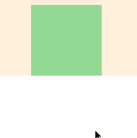
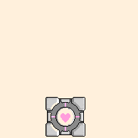
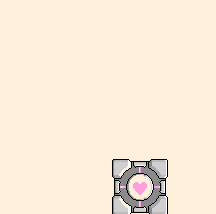

# Dodge

We are going to make a bullet dodging game:

- [Play The Game](http://output.jsbin.com/dozoki/62)
- [See The Code](http://jsbin.com/dozoki/62/edit?js,output)

## Steps

We broke this game up into the below 10 steps.

1. Open up this JS Bin.
2. Follow along with the below steps

| **[            1.  Blank Canvas]      (#TODO)** | **[      2. Add Player Sprite](#TODO)**     | **[    3. Linear Player Movement] (#TODO)** |
|:---------------------------------------------------------------------------------|:----------------------------------------------------------------------------------|:---------------------------------------------------------------------------------------|
| **[      4.  Arrow Key Movement](#TODO)** | **[           5. Player Image]         (#TODO)** | **[                 6. Add Enemy]              (#TODO)** |
| **[   7.  Enemy Sprite Move] (#TODO)** | **[   8. Enemy Go Back to Top] (#TODO)** | **[     9. Random Enemy Position]  (#TODO)** |
| **[              10. Game Over]         (#TODO)** |                                                                                   |                                                                                        |
