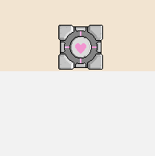

# Dodge

We are going to make a bullet dodging game:

- [Play The Game](http://output.jsbin.com/dozoki/62)
- [See The Code](http://jsbin.com/dozoki/62/edit?js,output)

## Steps

Follow along with each of the below steps:

| **[            1.  Blank Canvas]      (blank_canvas.md)**          | **[      2. Add Player Sprite]    (add_player_sprite.md)**    | **[    3. Linear Player Movement] (linear_player_movement.md)** |
|:----------------------------------------------------------------------------------------------------|:----------------------------------------------------------------------------------------------------|:-----------------------------------------------------------------------------------------------------------|
| **[      4.  Arrow Key Movement](arrow_key_movement.md)**    | **[           5. Player Image]         (player_image.md)**         | **[          6. Add Enemy Sprite]       (add_enemy_sprite.md)**       |
| **[   7.  Enemy Sprite Move] (linear_enemy_movement.md)** | **[   8. Enemy Go Back to Top] (enemy_go_back_to_top.md)** | **[     9. Random Enemy Position]  (random_enemy_position.md)**  |
| **[              10. Game Over]         (game_over.md)**             |                                                                                                     |                                                                                                            |
