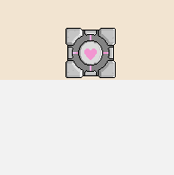
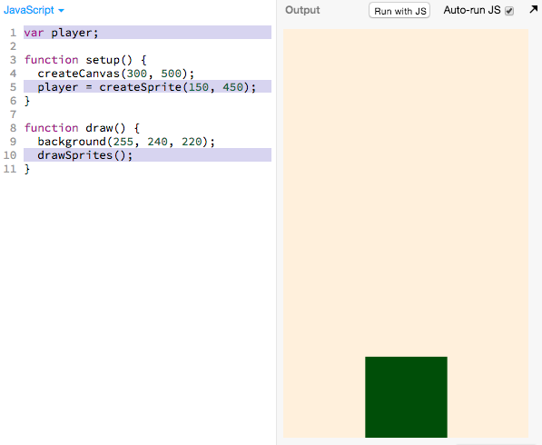
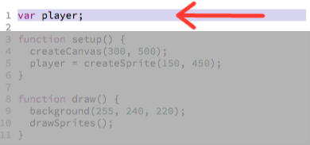
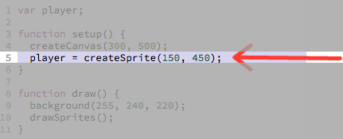
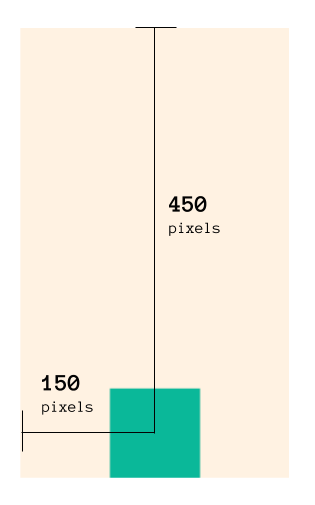
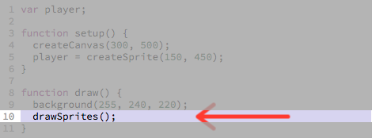
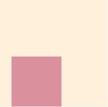

# Adding the Player Sprite

Currently our canvas is blank like this:

> 

We want to eventually make the player sprite look like this:

> 

But for now, we'll settle with this:

> 

## Adding the player sprite

New lines of code added to create and draw a sprite are highlighted in purple:

> [](http://jsbin.com/qiyuno/14/edit?js,output)

[Open in JS Bin](http://jsbin.com/qiyuno/14/edit?js,output)

## Try Messing Around with the Starting Position

Try messing around with the starting position in [this JS Bin ](http://jsbin.com/qiyuno/14/edit?js,output).

> 

## Code Overview

First we need to create the variable `player`:

> 

Then we actually create the sprite and store it in the variable `player`:

> 

```
player = createSprite(150, 450);
  ^                    ^    ^
  |                    |    └ set the *y* coordinate of the sprite
  |                    |
  |                    └ set the *x* coordinate of the sprite
  └ Store the newly
    created sprite
    with the variable `player`
```

> 

Then we have to tell the program to actually draw the sprites in our program by
calling `drawSprites()`:

> 

If we don't include `drawSprites()`, even if the sprites have been created, you
cannot see them.

## Adding the Sprite to Your Code

 Now add the 3 lines of code needed to add the sprite to your "_**working bin**_".

## Next Up

| **[  <br> 3. Linear Player Movement] (linear_player_movement.md)**    |
|:----------------------------------------------------------------------------------------------------|

---
## Appendix

### Documentation 

#### [p5.js Play Documentation](http://p5play.molleindustria.org/docs/index.html)

- [`createSprite(150, 450)`](http://p5play.molleindustria.org/docs/classes/p5.play.html#method-createSprite)

#### Understanding the Computer Science Fundamentals 

```
This section goes over some of the fundamental programming concepts, you can
feel free to skip this section if you like.
```

In order for a program to remember something, we must use a variable to
remember it. And so we create the `player` variable to remember the player sprite.

> 

`createSprite is a function` functions have 3 components

- inputs
- actions
- output

...
