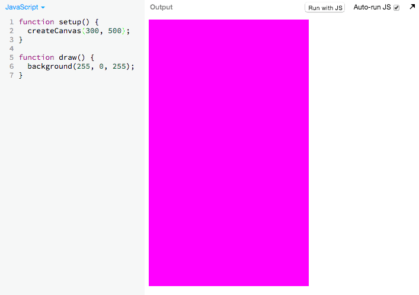
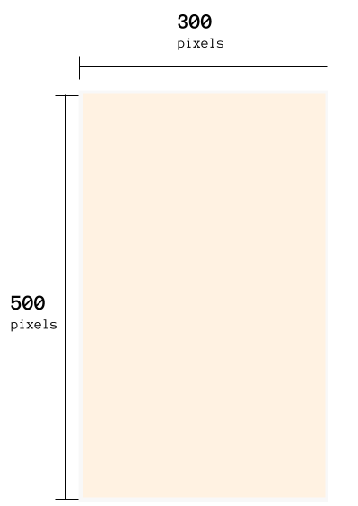
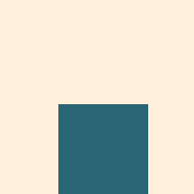
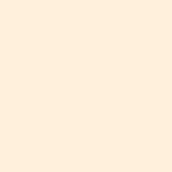

# Blank Canvas

We'll be using JS Bin for this tutorial. Feel free to use your own editor.

 If you are using JS Bin, make sure you have created an
account [by following these directions](#TODO).

 Then open [this pre-made JS Bin template]
(http://jsbin.com/kecodi/3/edit?js,output). You will be building off this
template throughout the tutorial. We'll call this the "_**working bin**_"

Here is the excerpt of the code from the JS Bin template:

```js
function setup() {
  createCanvas(300, 500);
}

function draw() {
  background(255, 240, 220);
}
```

In this part, we won't talk about what `function setup()` and `function draw()`
are. We'll cover those in more detail later.

 Try changing around with some of the values in the JS Bin
to figure out what they do. Below are some gifs of me messing around:

## Messing with the canvas size:

> 

 Try changing some of the values of `createCanvas` to
understand what it does.

#### Code explanation:

`createCanvas` creates and sets the size of the canvas:

```
createCanvas(300, 500);
              ^    ^
              |    └ set the *height* of the drawing area to 400
              |
              └ set the *width* of the drawing area to 600
```



<!-- Google Drawing https://docs.google.com/drawings/d/1iYQ3oXxg7qAcQtRckF8DCgAL8V2A9VAM1_z8OFxoxjo/edit?usp=sharing -->

## Messing around with the background color:

> 

```
This code sets the background color of the canvas:

  background(255, 255, 255);
              ^    ^    ^
              |    |    └ set how much *red* there is
              |    |    
              |    └ set how much *green* there is
              |
              └ set how much *blue* there is

```

 Try changing some of the values of `background`
to understand what it does.

## Setting the Proper Dimensions

Now that you've gotten a chance to experiment, we want our canvas to have a
width of 300 and a height of 500.

 Go ahead and make sure that your setup function looks
like this:

```js
function setup() {
  createCanvas(300, 500);
}
```

## Next Up

| **[    <br> 2: Adding the Player Sprite]    (add_player_sprite.md)**    |
|:----------------------------------------------------------------------------------------------------|

---

## Appendix

### Documentation 

#### p5.js Documentation

- [`background(255, 255, 255)`](http://p5js.org/reference/#/p5/background)
- [`createCanvas(300, 500);`](http://p5js.org/reference/#/p5/createCanvas)

#### Associated Modules:

| **[          <br> 1.  Blank Canvas]      (blank_canvas.md)**          |
|:----------------------------------------------------------------------------------------------------|

TODO:

- Include:
  - Lots of examples inside of here of creating different colored canvases
  - Maybe they're different modules
    - setting the background color
    - changing the size of the canvas

#### Computer Science Fundamentals 

`createCanvas(300, 500)` and `background(255, 240, 220)` are what we
call _**functions**_.

Learn more about functions [here](#TODO).
