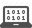

# Blank Canvas

We'll be using JS Bin for this tutorial. Feel free to use your own editor.

 If you are using JS Bin, make sure you have created an
account [by following these directions](#TODO).

 Then open [this pre-made JS Bin template]
(http://jsbin.com/kecodi/3/edit?js,output). You will be building off this
template throughout the tutorial.

Here is the excerpt of the code from the JS Bin template:

```js
function setup() {
  createCanvas(300, 500);
}

function draw() {
  background(255, 240, 220);
}
```

 Try changing around with some of the values in the JS Bin
to figure out what they do. Below are some gifs of me messing around:

## Messing with the canvas size:

> 

 Try changing some of the values of `createCanvas`
yourself.

#### Code explanation:

`createCanvas` creates and sets the size of the canvas:

```
createCanvas(300, 500);
              ^    ^
              |    └ set the *height* of the drawing area to 400
              |
              └ set the *width* of the drawing area to 600
```

## Messing around with the background color:

```
This code sets the background color of the canvas:

  background(255, 255, 255);
              ^    ^    ^
              |    |    └ set how much *red* there is
              |    |    
              |    └ set how much *green* there is
              |
              └ set how much *blue* there is

```

 Try changing some of the values of `background`
yourself.

## Next Up

| **[    <br> 2: Adding the Player Sprite]    (add_player_sprite.md)**    |
|:----------------------------------------------------------------------------------------------------|

---

## Appendix

### Documentation 

#### p5.js Documentation

- [`background(255, 255, 255)`](http://p5js.org/reference/#/p5/background)
- [`createCanvas(300, 500);`](http://p5js.org/reference/#/p5/createCanvas)

#### Associated Modules:

| **[          <br> 1.  Blank Canvas]      (blank_canvas.md)**          |
|:----------------------------------------------------------------------------------------------------|

#### Computer Science Fundamentals 

`createCanvas(300, 500)` and `background(255, 240, 220)` are what we
call _**functions**_.

Learn more about functions [here](#TODO).
