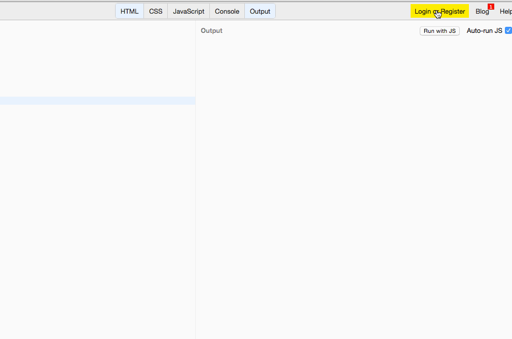
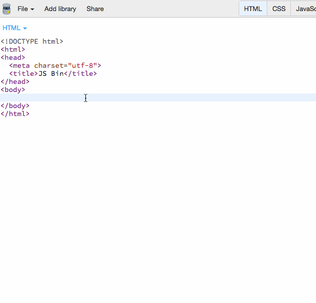
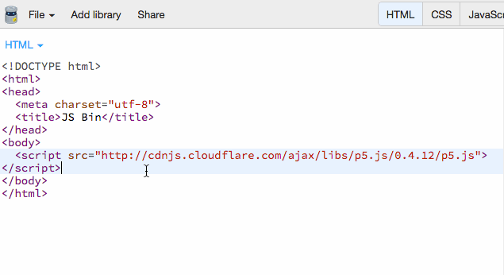
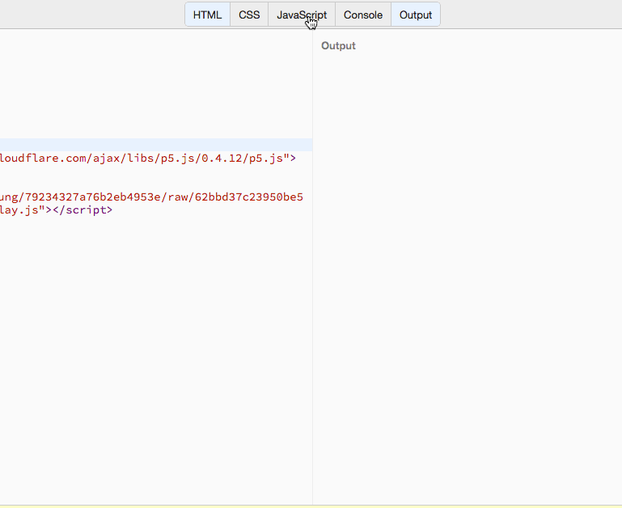
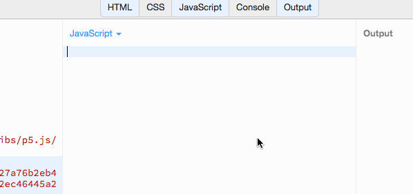
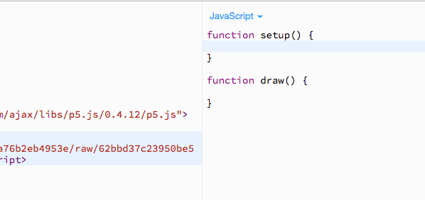
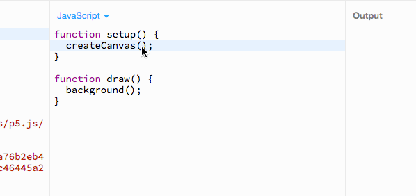
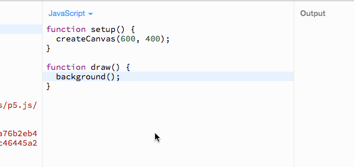

# The Game Buffet
You're probably a gamer. But do you know how games really work? In this workshop we are going to learn to build games.

## Goals
* Build an original game
* Show it to all your friends!

## Setting up the workspace
While creating our game we are going to be writing code in [JS Bin](http://jsbin.com). Think of JS Bin as TextEdit or Notepad for programming. 

Remember to close the popup!


Currently JS Bin will not save your work if you leave. This is incredibly annoying, especially if you have been working on your game for a large amount of time. We can fix this by logging in.

*Logging in with GitHub is a great way to avoid remembering another password*


In order to create our game quickly we are going to use a `library` called [p5js](http://p5js.org). A library is a useful piece of code someone else has written and published for other people to use and benefit from. [p5js](http://p5js.org)'s goal is to simplify the creation of interactive experiences (read: games).

Because we want to use p5js we are going to have to include it in our project. This is done with a `<script>` tag and its respective `src` setting which links to the library.


*The URL we are hosting p5js at is [http://cdnjs.cloudflare.com/ajax/libs/p5.js/0.4.12/p5.js](http://cdnjs.cloudflare.com/ajax/libs/p5.js/0.4.12/p5.js)*

[p5js](http://p5js.org) is fine by itself, however we are going to use another `library` to improve [p5js](http://p5js.org)'s game features called [p5.play](http://p5play.molleindustria.org/).

Again, we are going to want to include this within our project. We do this in the same way we included [p5js](http://p5js.org).




*The URL we are hosting [p5.play](http://p5play.molleindustria.org/) at is [https://rawgit.com/jonleung/79234327a76b2eb4953e/raw/62bbd37c23950be576afac9d8f78112ec46445a2/p5.play.js](https://rawgit.com/jonleung/79234327a76b2eb4953e/raw/62bbd37c23950be576afac9d8f78112ec46445a2/p5.play.js)*

## Initialize the engine!
The anatomy of a [p5js](http://p5js.org) game is quite simple. It consists of two pieces, `setup` and `draw`. We call these pieces `function`'s, a function is a piece of code which can be repeated on demand. It is important to realise here, that p5.play actually has access to these functions. This is how we will create our game.

Now, if you open the JavaScript tab of your JS Bin workspace.



You will see that there is nothing there... So where are our `setup` and `draw` functions? We need to create them.

A function has a simple anatomy and can be broken down into three parts:

1. Name - The identifier of the function
2. Parameters - Pieces of information available to the function (You can have 0 parameters)
3. Content - The guts of the function. This is where your code goes

Here is an example function:

```javascript
function writeEssay(subject, timeLimit, wordCount) {
	// work work work work
}
```

It can be broken down into the following table:

| Name | Parameters | Content |
|------|------------|---------|
|writeEssay| `subject`, `timeLimit`, `wordCount`| `// work work work work`|

You would call this function like this in your code

*You can do anything which you would do with normal JavaScript inside of a function*


Now, lets make these functions.



[p5.play](http://p5play.molleindustria.org/) relies on functions with these names existing. So remember to copy them down exactly.

We are almost done setting up, but we should definitely make sure that what we have written works! Two functions provided by the [p5.play](http://p5play.molleindustria.org/) library are `createCanvas` and `background`. `createCanvas` gives our game a place to be drawn (Imagine a literal painting canvas). `background` paints the background of our canvas a certain color. Lets put these to use in our code.



This looks well and good, however both `createCanvas` and `background` require parameters (The little pieces of data we talked about above) to be specified.

`createCanvas` requires two numbers specifiying the size of the games screen. The first is width, the second is height. You can use any size you want in your game! However a common size is `600` wide and `400` high.



`background` requires three numbers representing a color. These numbers range from 0 (nothing) to 255 (full). The first number represents red, the second green and the third blue. This format is called RGB. I suggest using http://colorpicker.com to choose your colors.



## Making a game
